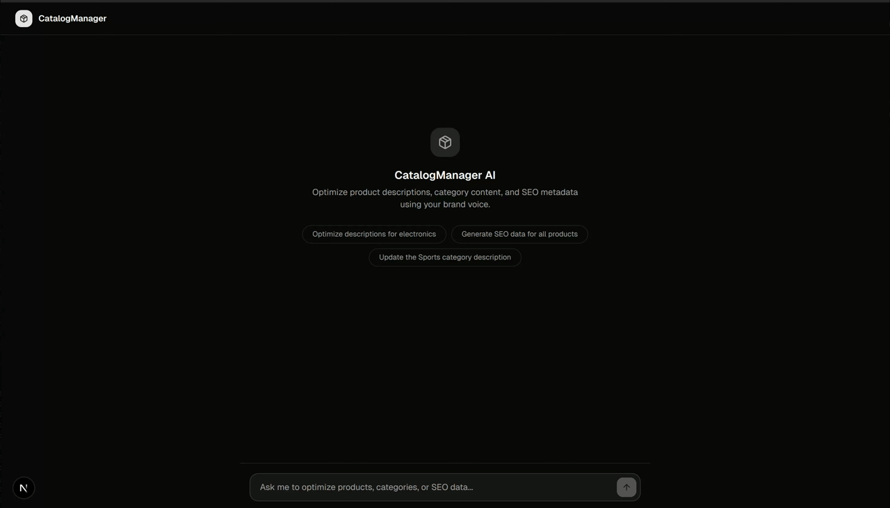

# CatalogManager AI

An AI-powered e-commerce catalog content optimizer built on **Vercel Workflows** and the **Vercel AI SDK**. CatalogManager AI uses a Durable Agent to orchestrate multi-turn conversations where catalog operators can generate, review, edit, and approve product descriptions and SEO metadata — all guided by brand voice.

### → [Architectural Decisions](#architectural-decisions)


## Features

- **Multi-turn conversational AI** — Chat naturally with the agent across multiple turns within a single persistent workflow session
- **Product & category description generation** — Bulk-generate short and long descriptions aligned to your brand voice
- **SEO metadata optimization** — Generate meta titles and meta descriptions for products and categories
- **Human-in-the-loop approval** — Review proposed changes in a side panel, edit inline, and approve before any data is saved
- **Brand voice consistency** — The agent retrieves your brand voice guidelines before generating any content
- **Session persistence & resumption** — Share or revisit sessions via URL, with automatic reconnection to in-progress workflows
- **Real-time streaming updates** — Watch content generation progress item-by-item with status indicators (Pending, In Progress, Done)



## Vercel Technology

### Vercel Workflows with Durable Agent

The core of the application is a **Vercel Workflow** (`workflow` v4.2.0-beta) that manages the entire conversation lifecycle. The workflow is defined in [`src/workflows/catalog-agent.ts`](src/workflows/catalog-agent.ts) using the `"use workflow"` directive, and is integrated into Next.js via `withWorkflow()` in `next.config.ts`.

**DurableAgent** from `@workflow/ai/agent` provides a stateful, resumable AI agent that persists across HTTP requests. The agent is initialized once per session with a system prompt and seven tools, then runs in a loop — processing messages, streaming responses, and waiting for the next user input via a hook:

```ts
const agent = new DurableAgent({
  model: "anthropic/claude-sonnet-4-6",
  instructions: SYSTEM_PROMPT,
  tools: catalogTools,
});

while (true) {
  const result = await agent.stream({ messages, writable, preventClose: true });
  messages.push(...result.messages);
  const { message: followUp } = await hook; // pause until next user message
  if (followUp === "/done") break;
  messages.push({ role: "user", content: followUp });
}
```

**Workflow Hooks** enable two key interaction patterns:

- **`chatMessageHook`** — Injects follow-up user messages into the running workflow. The frontend sends messages to `POST /api/chat/[id]`, which resumes the hook with the new input.
- **`contentApprovalHook`** — Powers human-in-the-loop approval for save operations. When `save_products` or `save_categories` executes, it creates a hook using the **tool call ID as the resumption token**, then blocks. On the frontend, `chat-interface.tsx` scans message parts for tool UI parts whose state is not yet `"output-available"` — matching on tool names `save_products`/`save_categories` — to surface Approve/Reject buttons. When the user clicks one, the frontend POSTs to `/api/hooks/approval` with `{ toolCallId, approved }`, which resumes the hook and either persists the updates or returns a rejection message. This toolCallId-as-token pattern is what bridges the workflow's hook system to the UI without any extra mapping layer.

**Workflow Observability** — The workflow emits structured data markers via `getWritable()` throughout execution, including turn numbers, step counts, timing, and tool call telemetry.

### Vercel AI SDK

The application uses **AI SDK** v6 (`ai` and `@ai-sdk/react`) for structured generation, streaming, and React integration.

**Multi-model strategy:**
- **Claude Sonnet 4.6** (`anthropic/claude-sonnet-4-6`) — Powers the DurableAgent for complex reasoning, tool orchestration, and multi-turn conversation
- **Claude Haiku 4.5** (`anthropic/claude-haiku-4-5`) — Used by generation tools (`generate_descriptions`, `generate_seo_data`) for fast, cost-efficient content creation with structured output via `Output.object()` and Zod schemas

**Frontend integration:**
- `useChat` from `@ai-sdk/react` with `WorkflowChatTransport` from `@workflow/ai` provides workflow-aware chat state management
- `createUIMessageStreamResponse` enables token-level streaming from API routes
- Data parts (`data-product-content`, `data-category-content`) stream real-time status updates to the frontend, where they are aggregated into a unified review panel

### Tools as Durable Steps

Tool functions marked with `"use step"` execute as durable steps within the workflow, providing reliability guarantees. The seven tools cover the full catalog optimization lifecycle:

| Tool | Purpose |
|------|---------|
| `get_products` | Fetch products by category or all |
| `get_categories` | Fetch categories |
| `get_brand_voice` | Retrieve brand voice guidelines |
| `generate_descriptions` | Generate short + long descriptions |
| `generate_seo_data` | Generate meta title + description |
| `save_products` | Persist approved product updates (blocks on `contentApprovalHook`) |
| `save_categories` | Persist approved category updates (blocks on `contentApprovalHook`) |

The save tools follow a **hook-gated persistence** pattern: the tool's `execute` function creates a `contentApprovalHook` with `token: toolCallId`, then `await`s the hook — suspending the workflow. The actual persistence (`persistProductUpdates` / `persistCategoryUpdates`) only runs after the hook resumes with `approved: true`. This means the agent can call `save_products` immediately after generation, but no data is written until the human approves via the review panel.

## Architecture

```
Frontend (Next.js App Router)
  ├── ChatInterface ─── useMultiTurnChat() ─── WorkflowChatTransport
  │     └── ChatInput / ChatMessage
  └── CatalogPanel ─── BulkEditTable (inline editing + approval)

API Routes
  ├── POST /api/chat          → start(catalogAgentWorkflow)
  ├── POST /api/chat/[id]     → chatMessageHook.resume()
  ├── GET  /api/chat/[id]/stream → reconnect to workflow stream
  └── POST /api/hooks/approval → contentApprovalHook.resume()

Workflow (Vercel Workflows)
  └── catalogAgentWorkflow
        ├── DurableAgent (Claude Sonnet 4.6)
        ├── 7 tools (fetch, generate, save)
        ├── chatMessageHook (multi-turn)
        └── contentApprovalHook (human-in-the-loop)
```

## Architectural Decisions

### 1. Single Workflow Per Session
Each user session is a single, long-running `catalogAgentWorkflow` instance. The entire conversation — all turns, all tool calls, all state — lives inside one workflow run. Follow-up messages are injected via `chatMessageHook` rather than starting a new run.

---

### 2. Dual-Model Strategy: Orchestrator vs. Generator
Two separate Claude models serve distinct roles:

- **Claude Sonnet 4.6** — Runs the `DurableAgent`. Handles multi-step reasoning, tool orchestration, and interpreting ambiguous user intent across multi-turn conversations. Used for its stronger reasoning capability.
- **Claude Haiku 4.5** — Runs inside `generate_descriptions` and `generate_seo_data`. Handles fast, structured content generation via `Output.object()` and a Zod schema. Used for cost efficiency and speed on repetitive generation tasks.

**Rationale:** Separating orchestration from generation allows each layer to use the right model for the right job. Haiku is called once per item in a loop; using Sonnet here would be unnecessarily expensive.

---

### 3. `toolCallId` as the Approval Resumption Token

When `save_products` or `save_categories` runs, it creates a `contentApprovalHook` using the tool call's own `toolCallId` as the token:

```ts
const hook = contentApprovalHook.create({ token: toolCallId });
```

The frontend identifies pending save tool calls by scanning message parts for `save_products`/`save_categories` without output, then POSTs the same `toolCallId` to `/api/hooks/approval` to resume the hook.

This eliminates any need for a separate ID mapping layer — the same identifier used by the AI SDK to track tool calls is reused as the workflow resumption key.

Note: The name "save*" is misleading since the tool doesn't immediately save, created it before fully understanding the approval hook flow 

---

### 4. Agent Calls Save Immediately — Approval Is a Workflow Concern
The system prompt instructs the agent to call `save_products` or `save_categories` immediately after content generation.
The save tool itself suspends, indefinitely, via the approval hook until the human acts in the review panel.

Note: The name "save*" is misleading since the tool doesn't immediately save, created it before fully understanding the approval hook flow 
---

### 5. Per-Item Generation as Durable Steps
Each call to `generateSingleDescription` and `generateSingleSeoData` is a `"use step"` function inside the generation tools. This means:
- Each item is independently retried on failure (transient LLM errors don't restart the whole batch)
- Per-item progress is observable in the Vercel Workflows dashboard
- The workflow can resume from the last incomplete item after a crash

**Rejected alternative:** Processing all items in a single LLM call would be faster but loses per-item retry guarantees and makes structured output harder to validate.

---

### 6. Streaming Data Parts for Real-Time UI Status
Generation tools emit custom `UIMessageChunk` data parts (`data-product-content`, `data-category-content`) with a status field (`Pending → InProgress → Done`) as each item is processed:

```ts
writer.write({ type: "data-product-content", id: `${toolCallId}-${sku}`, data: { status: "InProgress", ... } });
```

The frontend aggregates these parts into a unified catalog panel without polling or a separate state management layer. The AI SDK's data parts streaming is the only transport used.

---

### 7. Session Persistence via URL + `localStorage` + Stream Reconnection
The workflow run ID is persisted in both `localStorage` and as a `?session=` URL query parameter. On page load, `useMultiTurnChat` checks for an existing run ID and reconnects to the live stream via `GET /api/chat/[id]/stream`. This allows sharing sessions by URL and surviving page refreshes without losing state.

---

### 8. In-Memory Store (POC-First, No Database)
Product and category data live in JSON fixtures in `lib/data/`. Approved saves update an in-memory mutable store (`lib/data/store.ts`). No database, no auth, no persistence across server restarts.

**Why:** The project constitution mandates POC-first simplicity. Introducing a database would add operational complexity before the core AI workflow is validated.

---

### 9. Zod Schemas as the Shared Type Layer
Zod schemas in `lib/schemas/` serve three purposes simultaneously:
1. **Runtime validation** — Tool inputs are validated via `inputSchema` Zod objects
2. **Structured generation** — `Output.object({ schema })` passes the Zod schema directly to `generateText` for constrained LLM output
3. **TypeScript types** — `z.infer<typeof schema>` provides static types across the codebase

One schema definition serves all three concerns with zero duplication.

---

### 10. `FatalError` vs. `RetryableError` for Workflow Failures
Tools use Vercel Workflows' error classification:
- `FatalError` — for validation failures (e.g., missing content fields, invalid update payloads) that should never be retried
- `RetryableError` — for transient failures (e.g., LLM API timeouts) that benefit from automatic retry

This prevents infinite retry loops on logic errors while enabling automatic recovery from network-level failures.

---

### 11. Generated Content Is Never Echoed in Chat
The system prompt explicitly instructs the agent **not** to repeat or summarize generated descriptions or SEO data in its chat response. All content is surfaced exclusively via the streaming `data-product-content`/`data-category-content` parts rendered in the catalog panel.

**Why:** Duplicating content in the chat creates noisy, hard-to-read conversations and wastes output tokens. The data part stream is the canonical content channel.

---

### 12. Eval Strategy: Deterministic Mocks + Optional Live LLM
The eval suite (`src/__tests__/evals/`) tests agent behavior at two levels:

- **Mocked evals** — `MockLanguageModelV3` from `ai/test` replays scripted tool-call sequences deterministically. Tool `execute` functions are replaced with `vi.fn()` mocks. Assertions target tool names, parameter shapes, and call ordering — not LLM text output. These run in under 60 seconds with no API dependency.
- **Live LLM evals** — Same mock tool `execute` functions, but real `anthropic/claude-haiku-4-5` model reasoning. Gated by `EVAL_LIVE_LLM` + `AI_GATEWAY_API_KEY` env vars. Validates that the system prompt produces correct tool routing with real model inference.

`DurableAgent` is tested directly (bypassing the workflow runtime) by passing a mock model via the function form: `model: () => Promise.resolve(mockModel)`.

---

## Getting Started

```bash
npm install
cp .env.example .env.local
# Add your Vercel AI Gateway key
# AI_GATEWAY_API_KEY=your_key_here
npm run dev
```

The app runs on [http://localhost:3000](http://localhost:3000).

## Evaluations

The project includes an evaluation suite in [`src/__tests__/evals/`](src/__tests__/evals/) that validates agent behavior using the `DurableAgent` directly — testing tool selection, ordering, parameter correctness, and multi-turn flows.

### Running Evals

```bash
# Run mocked evals (fast, deterministic, no API calls)
npm run test:evals

# Run with live LLM evals included (requires API key, ~120s timeout per test)
EVAL_LIVE_LLM=1 npm run test:evals
```

### Eval Structure

Each eval file contains two test suites: a **mocked suite** for fast deterministic testing and an optional **live LLM suite** (gated behind `EVAL_LIVE_LLM`) that runs against a real model (`anthropic/claude-haiku-4-5`).

**Mocked evals** use a `MockLanguageModelV3` ([`helpers/mock-model.ts`](src/__tests__/evals/helpers/mock-model.ts)) that replays scripted tool call sequences. Tool implementations are replaced with `vi.fn()` mocks ([`helpers/mock-tool-responses.ts`](src/__tests__/evals/helpers/mock-tool-responses.ts)) that return fixture data. This allows asserting exact tool call order, parameters, and absence of unwanted calls without any API dependency.

**Live LLM evals** use the same mock tool implementations but a real model, validating that the agent's system prompt produces correct tool routing when given natural language inputs.

### Eval Coverage

| Eval File | What It Tests |
|-----------|--------------|
| [`optimize-descriptions.eval.test.ts`](src/__tests__/evals/optimize-descriptions.eval.test.ts) | Description generation flow: `get_products` → `get_brand_voice` → `generate_descriptions`. Verifies category filtering, brand voice ordering, correct parameters, and no save without approval. |
| [`seo-optimization.eval.test.ts`](src/__tests__/evals/seo-optimization.eval.test.ts) | SEO generation flow: `get_products` → `get_brand_voice` → `generate_seo_data`. Verifies tool routing — `generate_descriptions` must NOT be called for SEO-only requests. |
| [`save-approval.eval.test.ts`](src/__tests__/evals/save-approval.eval.test.ts) | Multi-turn approval flow: Turn 1 generates content (no save), Turn 2 saves after user approval. Validates correct SKUs, update structure (content or seoContent present), and that all 6 electronics products are included. |
| [`edge-cases.eval.test.ts`](src/__tests__/evals/edge-cases.eval.test.ts) | Edge cases: empty category returns no generation calls, "all products" omits `categoryId`, combined description + SEO request calls both generation tools. |

### Key Assertions

- **Tool ordering** — `get_brand_voice` is always called before any generation tool (enforced via `invocationCallOrder`)
- **Tool routing** — SEO requests only trigger `generate_seo_data`, not `generate_descriptions`
- **Safety** — `save_products` is never called without explicit user approval
- **Completeness** — Save operations include all expected SKUs with valid update payloads
- **Edge handling** — Empty results skip generation; broad requests omit category filters

## Tech Stack

- **Framework:** Next.js 16 (App Router)
- **Workflows:** Vercel Workflows v4.2.0-beta with DurableAgent
- **AI:** Vercel AI SDK v6, Claude Sonnet 4.6 + Haiku 4.5
- **UI:** React 19, Radix UI, Tailwind CSS 4
- **Validation:** Zod 4
- **Testing:** Vitest with mock + live LLM eval modes
